

    

<h1 align="center"><b>Vaultic</b></h1>
<h3 align="center">A light-weight, local and secure minty-fresh password manager built with a Tkinter-Based GUI.</h3>

<h2 align="center">Technology Stack</h2>

    
    
    
    

## Features
- User registration and login system
- Password encryption
- Add, edit and delete saved credentials
- Modern UI and fresh aesthetic with ttkbootstrap
- Multi-page navigation (Register, Login, Home, Edit Account Info, New Entry)
- Multi-level on-demand password generation following NIST guidelines

## How secure is my data?

Vaultic uses <a href="https://cheatsheetseries.owasp.org/cheatsheets/Password_Storage_Cheat_Sheet.html">Argon2id</a> (<a href="https://tuta.com/blog/best-encryption-with-kdf">winner of the 2013-2015 Password Hashing Competition</a>), to hash your master password and derive the encryption key for your data. When you're logged out, your data is fully encrypted - the SQLite database is dumped and encrypted using <a href="https://cryptography.io/en/latest/fernet/">Fernet symmetric encryption</a>. On successful login, the encryption key is regenerated using your master password and a uniquely randomised salt. In addition, the SQLite database is stored locally on your device, minimising your digital footprint and reducing exposure to online threats.

<h2>🗂️ <a href="https://trello.com/b/lMPEAwc6/vaultic">Vaultic Trello Board</a> 🗂️</h2>

### 🌟 Key Snapshots

#### 🖊️ Register 
[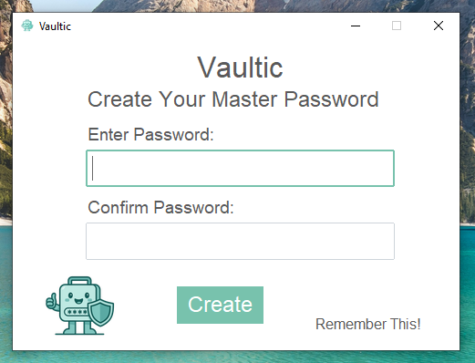](https://raw.githubusercontent.com/heyhenry/Vaultic/128a47c14d6bc4e7dbb7153af3d2db738f2ace22/img/snapshots/register.png)

#### 🏁 Login 
[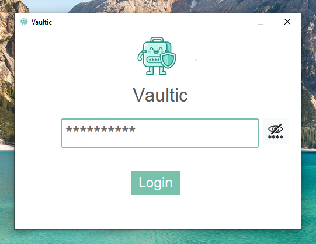](https://raw.githubusercontent.com/heyhenry/Vaultic/128a47c14d6bc4e7dbb7153af3d2db738f2ace22/img/snapshots/login_masked.png)

#### 🏠 Home
[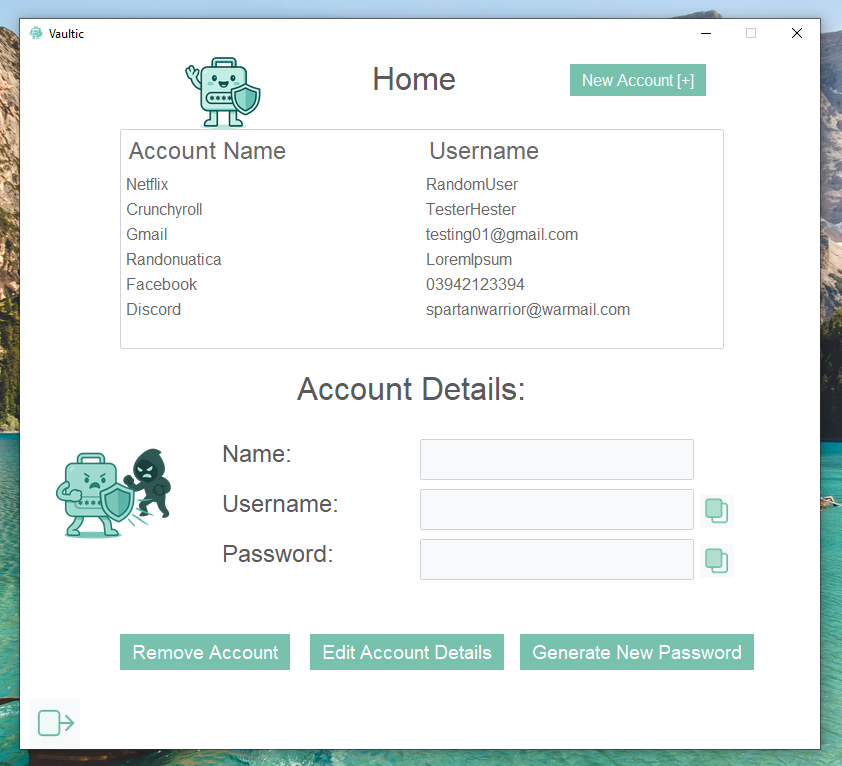](https://raw.githubusercontent.com/heyhenry/Vaultic/128a47c14d6bc4e7dbb7153af3d2db738f2ace22/img/snapshots/home.png)

#### 📜 Home - Account Details Display
[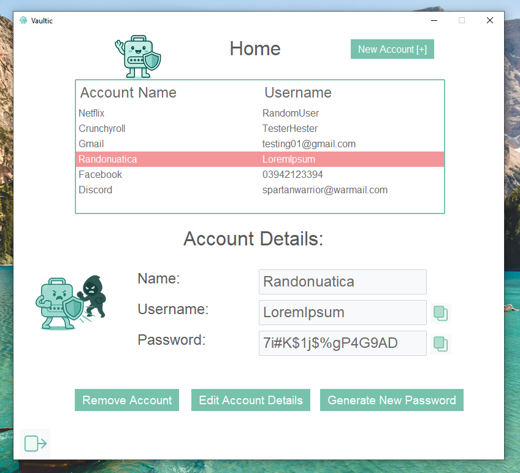](https://raw.githubusercontent.com/heyhenry/Vaultic/128a47c14d6bc4e7dbb7153af3d2db738f2ace22/img/snapshots/account_details.png)

#### ➕ Add New Account Entry
[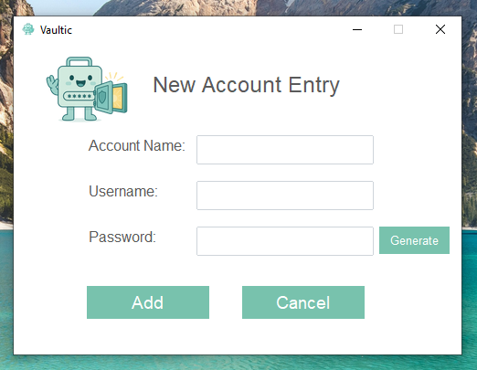](https://raw.githubusercontent.com/heyhenry/Vaultic/128a47c14d6bc4e7dbb7153af3d2db738f2ace22/img/snapshots/empty_new_entry.png)

#### ✏️ Edit Account Info
[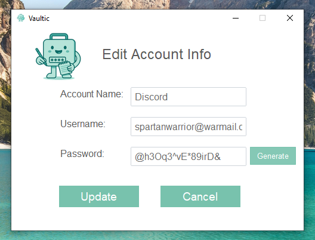](https://raw.githubusercontent.com/heyhenry/Vaultic/128a47c14d6bc4e7dbb7153af3d2db738f2ace22/img/snapshots/edit_account_info.png)

#### 🔔 Login - Startup Notification

---

  
📸 Full Snapshot Gallery (Click to expand)

### 🖊️ Register 

### 🖊️ Register - Error State - Mismatch
[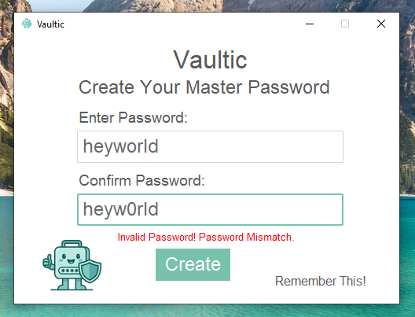](https://raw.githubusercontent.com/heyhenry/Vaultic/128a47c14d6bc4e7dbb7153af3d2db738f2ace22/img/snapshots/error_register_mismatch.png)

### 🖊️ Register - Error State - Whitespaces Only
[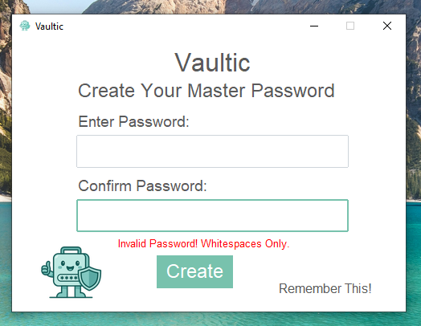](https://raw.githubusercontent.com/heyhenry/Vaultic/128a47c14d6bc4e7dbb7153af3d2db738f2ace22/img/snapshots/error_register_whitespace.png)

### 🖊️ Register - Error State - Minimum Length
[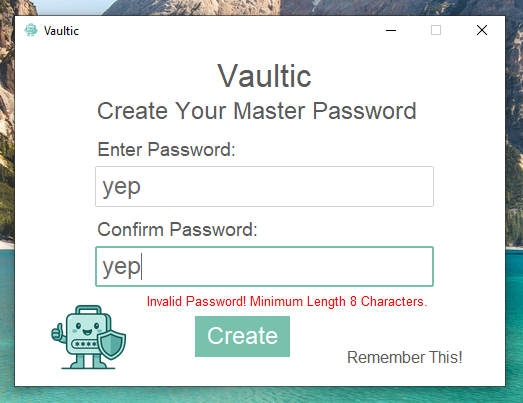](https://raw.githubusercontent.com/heyhenry/Vaultic/128a47c14d6bc4e7dbb7153af3d2db738f2ace22/img/snapshots/error_register_length.png)

### 🖊️ Register - Error State - Empty Input
[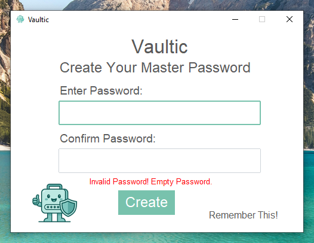](https://raw.githubusercontent.com/heyhenry/Vaultic/128a47c14d6bc4e7dbb7153af3d2db738f2ace22/img/snapshots/error_register_empty.png)

### 🔐 Login - Masked

### 🔐 Login - Unmasked
[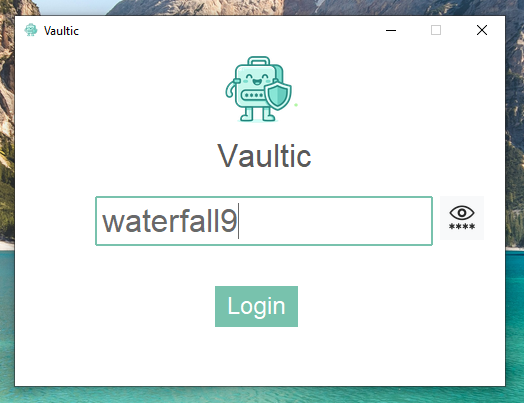](https://raw.githubusercontent.com/heyhenry/Vaultic/128a47c14d6bc4e7dbb7153af3d2db738f2ace22/img/snapshots/login_unmasked.png)

### 🔐 Login - Startup Notification

### 🔐 Login - Error State
[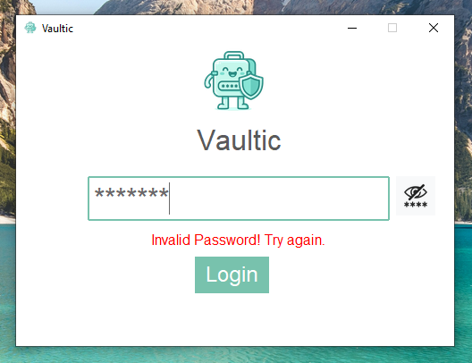](https://raw.githubusercontent.com/heyhenry/Vaultic/128a47c14d6bc4e7dbb7153af3d2db738f2ace22/img/snapshots/error_login.png)

### 🏠 Home - Populated

### 🏠 Home - Account Details Display

### 🏠 Home - Copied Username 
[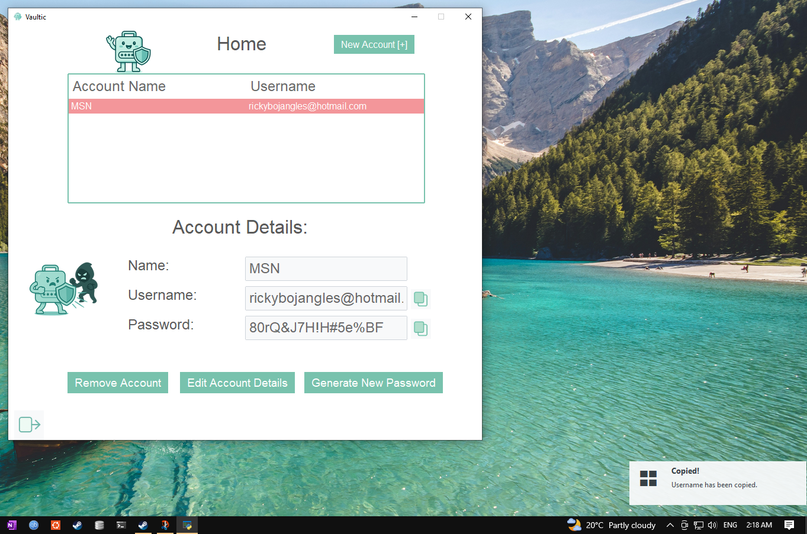](https://raw.githubusercontent.com/heyhenry/Vaultic/128a47c14d6bc4e7dbb7153af3d2db738f2ace22/img/snapshots/toast_home.png)

### ➕ New Account Entry

### ➕ New Account Entry - Error State
[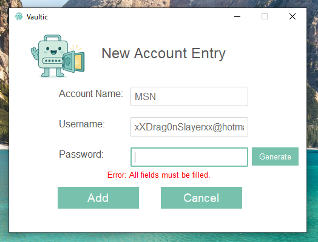](https://raw.githubusercontent.com/heyhenry/Vaultic/128a47c14d6bc4e7dbb7153af3d2db738f2ace22/img/snapshots/error_new_entry.png)

### ✏️ Edit Account Info

### ✏️ Edit Account Info - Error State
[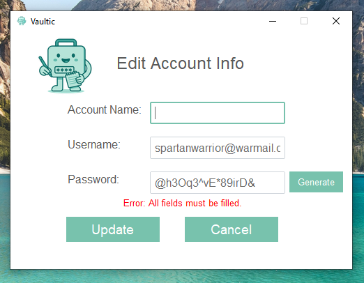](https://raw.githubusercontent.com/heyhenry/Vaultic/128a47c14d6bc4e7dbb7153af3d2db738f2ace22/img/snapshots/error_edit_account_info.png)

📚 <a href="resourced.md">Resources I used for Vaultic</a> 📚

### How Do I Use It?
Coming Soon.

> Built with ❤️ by [Henry Han](https://github.com/heyhenry)