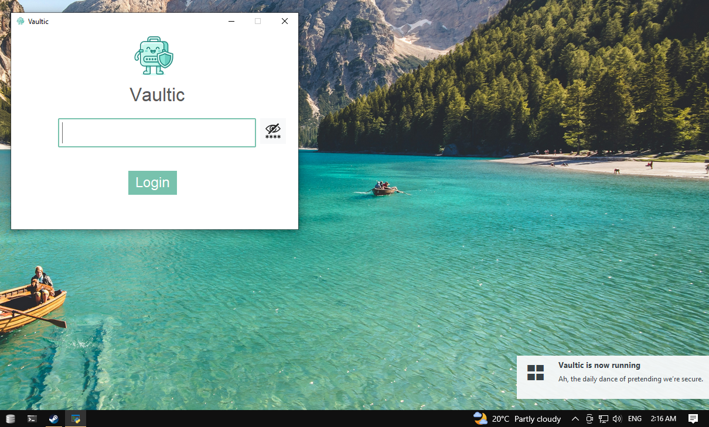
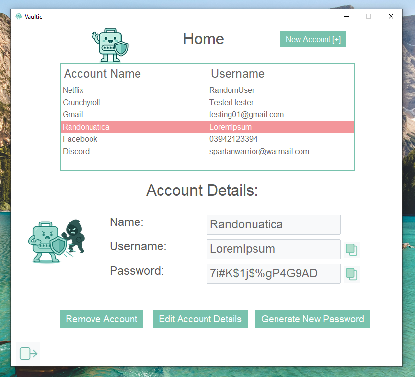
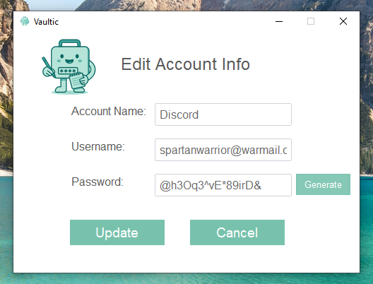

## 🔐 Vaultic - Password Manager

> A local, encrypted, and minty-fresh password manager built with Python, SQLite, and ttkbootstrap.

---

### 🌟 Key Screenshots

#### 🏁 Login Page

#### 🏠 Home Dashboard

#### ➕ Add New Entry

#### 🔔 Toast Notification

---

  
📸 Full Screenshot Gallery (Click to expand)

### 🔐 Login Page - Empty

### 🔐 Login Page - Error State

### 🏠 Home Page - Populated

### 🏠 Home Page - Account Details Display

### ✏️ Edit Entry Page

### ➕ New Entry - Invalid

<!-- Add all your bonus states/screens here -->

