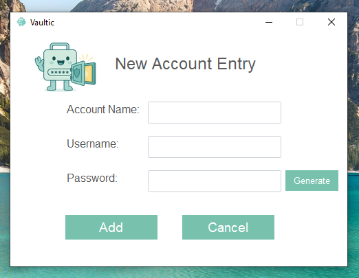
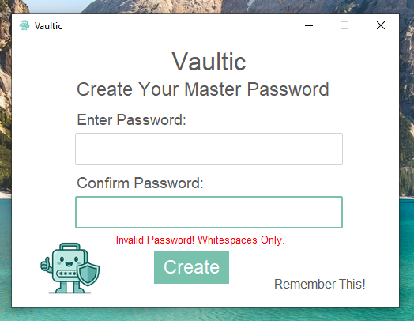
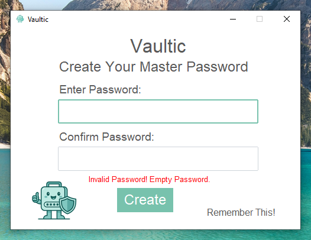
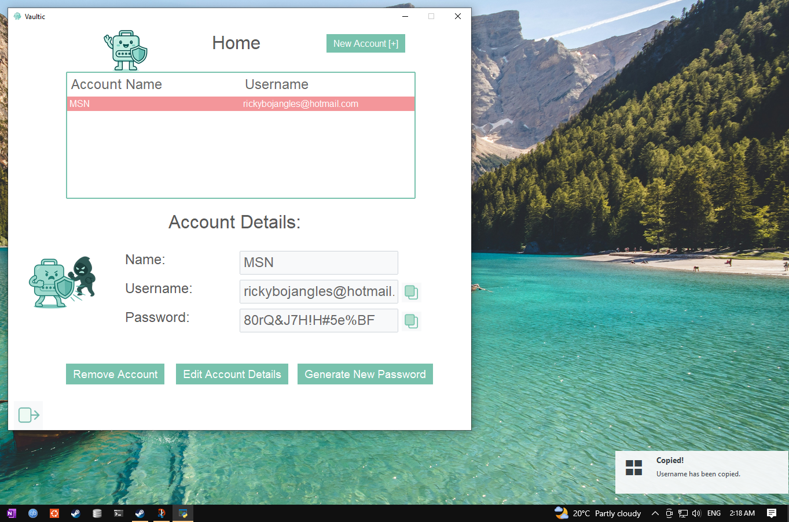
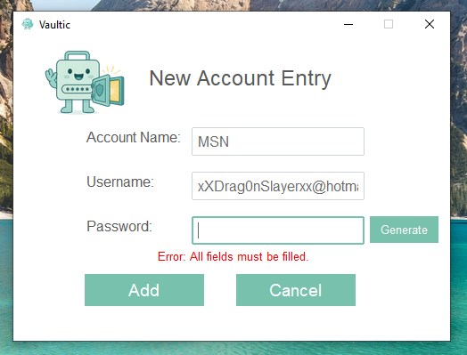
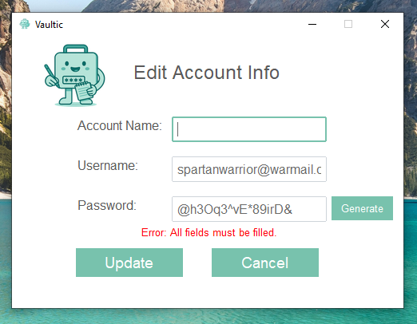

[## 🔐 Vaultic - Password Manager

> A local, encrypted, and minty-fresh password manager built with Python, SQLite, and ttkbootstrap.

---

### 🌟 Key Snapshots

#### 🖊️ Register 

#### 🏁 Login 

#### 🏠 Home

#### 📜 Home - Account Details Display

#### ➕ Add New Account Entry

#### 🔔 Login - Startup Notification

---

  
📸 Full Screenshot Gallery (Click to expand)

### 🖊️ Register 

### 🖊️ Register - Error State - Mismatch

### 🖊️ Register - Error State - Whitespaces Only

### 🖊️ Register - Error State - Minimum Length

### 🖊️ Register - Error State - Empty Input

### 🔐 Login - Masked

### 🔐 Login - Unmasked

### 🔐 Login - Startup Notification

### 🔐 Login - Error State

### 🏠 Home - Populated

### 🏠 Home - Account Details Display
(https://raw.githubusercontent.com/heyhenry/Vaultic/128a47c14d6bc4e7dbb7153af3d2db738f2ace22/img/snapshots/account_details.png)

### 🏠 Home - Copied Username 

### ➕ New Account Entry

### ➕ New Account Entry - Error State

### ✏️ Edit Account Info

### ✏️ Edit Account Info - Error State

<!-- Add all your bonus states/screens here -->

